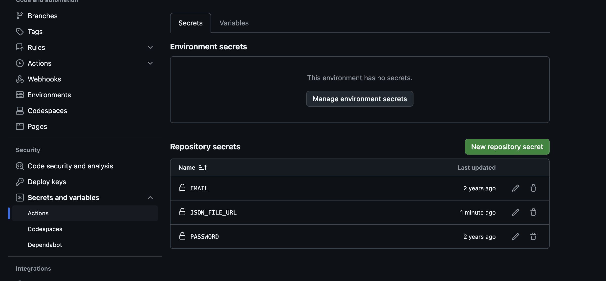

# PrizeBond Checker

Are you tired of manually checking your [prize bonds](https://savings.gov.pk/prize-bonds/) after every draw? **PrizeBond Checker** automates this process by sending you an email with the results, saving you time and effort. After each draw, you’ll receive a detailed email notification, so you'll instantly know if you’ve won!

## Features
- Automatically checks prize bonds against the latest draws.
- Sends detailed results via email.
- Simple setup using GitHub Actions or running locally.

## How to Use This Repository
1. **Fork the repository**.
2. **Enable GitHub Actions** (Settings -> Actions -> General -> Allow all actions).
3. **Set up required secrets**:
   Go to Settings -> Security -> Secrets and Variables -> Actions, and add the following secrets:

   | Secret          | Description                                      |
   |-----------------|--------------------------------------------------|
   | `EMAIL`         | Your Gmail address used for sending emails       |
   | `PASSWORD`      | Your Gmail account's app-specific password       |
   | `JSON_FILE_URL` | URL of the hosted JSON file containing prize bond information (e.g., [Gist](https://gist.github.com/)) |
   
   

   *Note: Gmail accounts may require you to generate an [app-specific password](https://support.google.com/accounts/answer/185833).*
4. **Submit your bonds**: If you prefer not to fork, you can submit your bonds in the required format via a [comment](https://gist.github.com/salman299/ca43c40c206db2677baf78978cda080b), and they will be added to the public list. You will receive emails every month based on your winnings.

---

## Prize Bond Data Format
The prize bond data should follow this structure:

```json
{
  "your_name": {
    "bonds": {
      "bond_value": [
        ["serial_start", "serial_end"],
        ["serial_start", "serial_end"]
      ]
    },
    "email": "your_email",
    "cc": ["email1", "email2"]
  }
}
```

### Explanation:

| Field           | Type            | Description                                      |
|-----------------|-----------------|--------------------------------------------------|
| `your_name`     | `str`           | Your name (e.g., "Ali Salman")                   |
| `bond_value`    | `str`           | Value of your bond (e.g., "100", "200", "750")   |
| `serial_start`  | `int`           | Starting serial number (e.g., 900101)            |
| `serial_end`    | `int`           | Ending serial number (e.g., 900200)              |
| `your_email`    | `str`           | Email to receive the results                     |
| `cc`            | `list[str]`     | List of emails to CC in the result notifications |

### Example:

```json
{
  "Ali Salman": {
    "bonds": {
      "200": [
        [900101, 900200],
        [890001, 890200]
      ],
      "750": [
        [670701, 670900]
      ]
    },
    "email": "salman.khuwaja29@gmail.com",
    "cc": ["xyz@example.com", "xyz1@example.com"]
  }
}
```

---

## Local Setup

If you want to run the checker locally, follow these steps:

### 1. Clone the repository:

```bash
git clone https://github.com/salman299/prizebond-checker.git
```

### 2. Create and activate a virtual environment:

If you don’t have `virtualenv`, install it by running:

```bash
pip install virtualenv
```

Then create and activate a virtual environment:

```bash
# Create a virtual environment named venv
virtualenv venv

# Activate the virtual environment
source venv/bin/activate
```

### 3. Install dependencies:

```bash
pip install -r requirements.txt
```

### 4. Run the script:

```bash
python3 ./main.py
```

---

## Optional Parameters

The script supports various optional parameters:

| Parameter          | Default         | Description                                                          |
|--------------------|-----------------|----------------------------------------------------------------------|
| `--year, -y`       | Current year    | Specify the year of the draw (e.g., `2022`)                          |
| `--month, -m`      | Current month   | Specify the month of the draw (e.g., `8` for August)                 |
| `--send-email, -se`| False           | Send the result via email if set to `True`                           |
| `--email, -e`      | None            | Sender's email (required if using `--send-email`)                    |
| `--password, -p`   | None            | Sender's email password (required if using `--send-email`)           |
| `--file, -f`       | `./sample.json` | Path to your prize bond JSON data file                               |
| `--file-url, -fu`  | None            | URL of the hosted JSON file containing prize bond data               |
| `--info`           | False           | Show logs of the prize bond checking process                         |
| `--debug`          | False           | Show detailed debug logs in the console                              |

### Example Commands:

- **Check bonds for August 2022**:

    ```bash
    python3 ./main.py --year 2022 --month 8 --info
    ```

- **Send email notifications**:

    1. **Using environment variables**:

    ```bash
    export EMAIL=<your_email>
    export PASSWORD=<your_password>
    python3 ./main.py --send-email --info
    ```

    2. **Passing email and password as arguments**:

    ```bash
    python3 ./main.py --email <your_email> --password <your_password> --send-email --info
    ```

- **Use a custom data file**:

    ```bash
    python3 ./main.py -y 2022 -m 8 -f ./example.json --info
    ```
